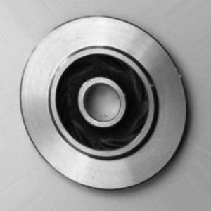
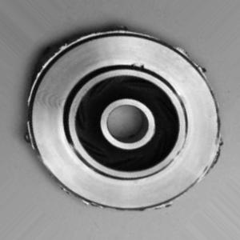
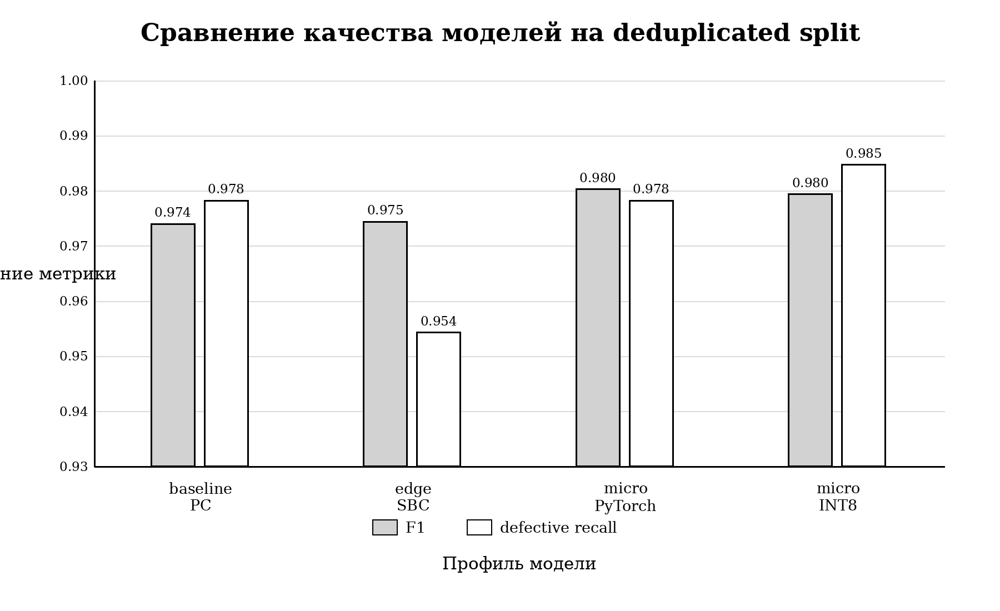
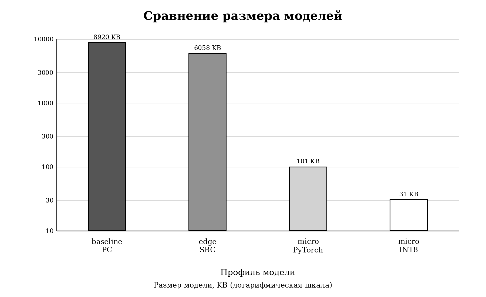
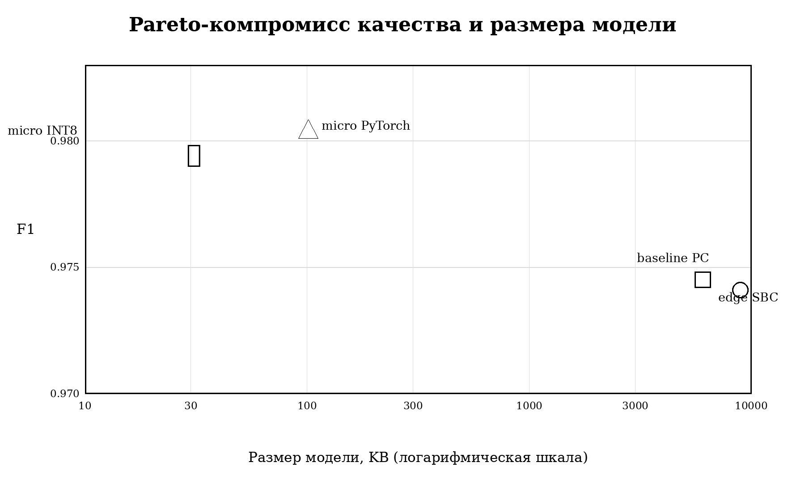
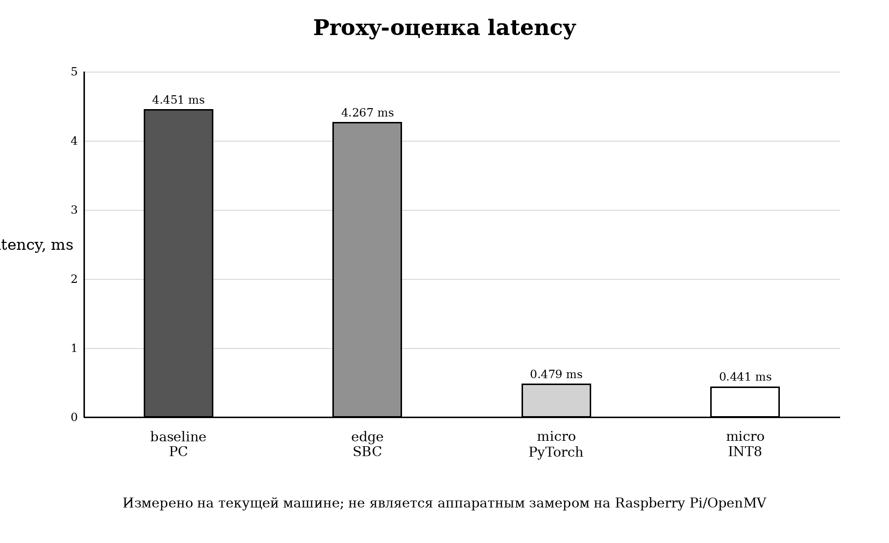
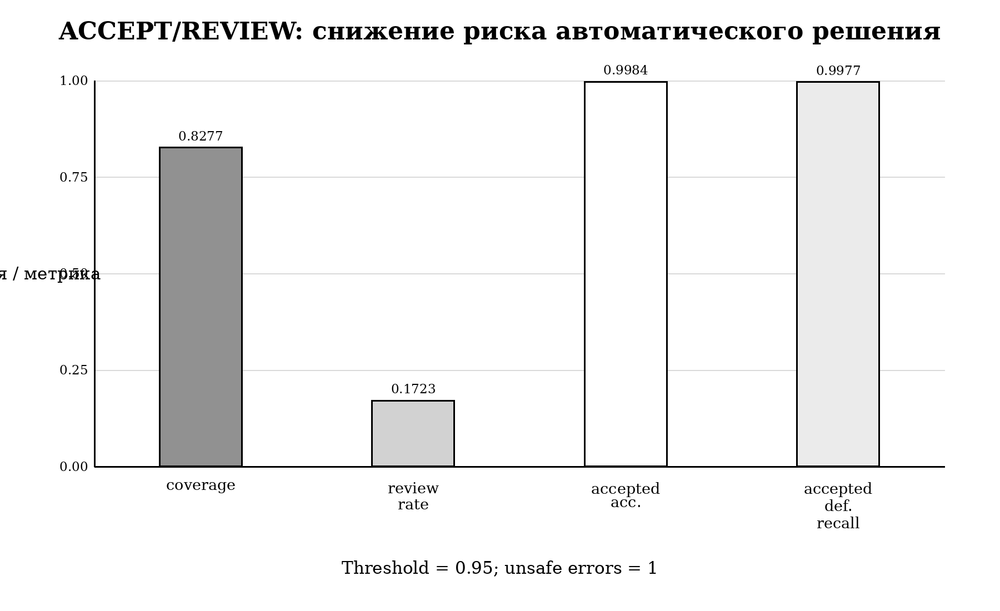
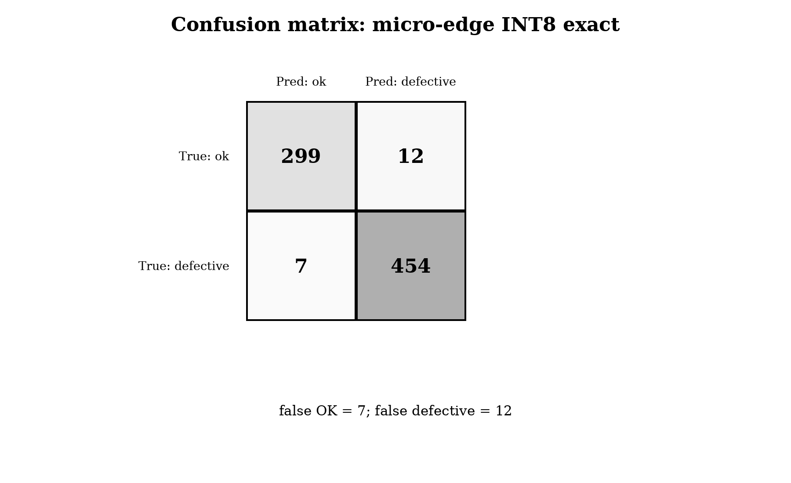

# Edge Casting Quality Inspection

Reproducible ML/R&D project for resource-aware computer vision quality inspection of casting products.

Тема НИР: **«Методика адаптации моделей компьютерного зрения для контроля качества литых изделий на edge-устройствах с различными ресурсными ограничениями»**.

Проект показывает не только обучение классификатора дефектов, а полный исследовательский pipeline: аудит данных, deduplicated split, сравнение PC/SBC/micro-edge профилей, exact TFLite INT8-конвертация, latency proxy benchmark и confidence-based ACCEPT/REVIEW.

## Кратко

- **Задача:** бинарная классификация литых изделий: `ok -> 0`, `defective -> 1`.
- **Датасет:** Kaggle `Casting Product Image Data for Quality Inspection`.
- **Основной протокол:** deduplicated split, чтобы exact/near-duplicates не попадали одновременно в train/val/test.
- **Лучший micro-edge результат:** `micro_edge INT8 exact`, 31 KB, F1 `0.9795`, defective recall `0.9848`.
- **Формат для edge:** exact TFLite INT8, полученный из micro-edge модели без отдельного переобучения Keras-модели.
- **Ограничение:** latency измерялась как proxy на текущей машине; Raspberry Pi/OpenMV аппаратно не тестировались.

## Визуальный обзор

### Примеры данных

| OK | DEFECTIVE |
|---|---|
|  |  |

### Качество моделей



### Размер модели



### Pareto: качество против размера



### Latency proxy



### ACCEPT/REVIEW triage



### Confusion matrix для exact INT8



## Основные результаты на deduplicated split

Clean split:

| Split | OK | DEFECTIVE | Total |
|---|---:|---:|---:|
| train | 2325 | 3022 | 5347 |
| val | 501 | 728 | 1229 |
| test | 311 | 461 | 772 |

Метрики на clean test:

| Профиль | Accuracy | F1 | Defective recall | False OK | Размер | Latency proxy |
|---|---:|---:|---:|---:|---:|---:|
| baseline PC | 0.9689 | 0.9741 | 0.9783 | 10 | 8919.5 KB | 4.451 ms |
| edge SBC | 0.9702 | 0.9745 | 0.9544 | 21 | 6057.6 KB | 4.267 ms |
| micro PyTorch | 0.9767 | 0.9804 | 0.9783 | 10 | 101.3 KB | 0.479 ms |
| micro INT8 exact | 0.9754 | 0.9795 | 0.9848 | 7 | 31.0 KB | 0.441 ms |

Главный вывод: micro-edge модель после exact INT8-конвертации сохраняет качество на уровне крупных моделей, но радикально снижает размер артефакта и proxy latency.

## Data leakage audit

Исходный split датасета содержит дубликаты и near-duplicates между train/val/test. Поэтому в работе используется clean split по группам похожих изображений.

| Проверка | Результат |
|---|---:|
| Exact duplicate groups | 64 |
| Cross-split exact duplicate groups | 64 |
| Near cross-split pairs, `ahash <= 4` | 191085 |
| Dedup groups | 2368 |

Deduplicated split protocol:

- `experiments/research_20260601/scientific_strengthening/dedup_split_protocol/`
- `experiments/research_20260601/scientific_strengthening/dedup_split_protocol/create_dedup_split.py`

## Exact TFLite INT8

Финальные edge-артефакты:

- `experiments/research_20260601/dedup_training/exported/micro_edge_dedup_exact_fp32.tflite`
- `experiments/research_20260601/dedup_training/exported/micro_edge_dedup_exact_int8.tflite`

TFLite INT8:

| Параметр | Значение |
|---|---:|
| Size | 31.0 KB |
| Accuracy | 0.9754 |
| F1 | 0.9795 |
| Defective recall | 0.9848 |
| False OK | 7 |
| Input | `[1, 128, 128, 3] int8` |
| Output | `[1, 2] int8` |
| Ops | `CONV_2D`, `MAX_POOL_2D`, `MEAN`, `FULLY_CONNECTED`, `DELEGATE` |

## Confidence-based ACCEPT/REVIEW

Для промышленного контроля пропустить дефект опаснее, чем отправить годное изделие на дополнительную проверку. Поэтому добавлен triage-режим: модель принимает автоматическое решение только при достаточной уверенности.

Low-risk режим для INT8:

| Threshold | Coverage | Review rate | Accepted accuracy | Accepted defective recall | Unsafe errors |
|---:|---:|---:|---:|---:|---:|
| 0.95 | 0.8277 | 0.1723 | 0.9984 | 0.9977 | 1 |

## Структура snapshot

```text
src/                                      # package code
scripts/                                  # CLI wrappers
configs/                                  # dataset/model/experiment configs
tests/                                    # smoke tests
reports/final_nir/                        # LaTeX/PDF/figures
experiments/research_20260601/
  dedup_training/
    tables/                               # final CSV tables
    metrics/                              # metrics, reports, predictions
    exported/                             # exact TFLite FP32/INT8
  scientific_strengthening/
    dedup_split_protocol/                 # clean split protocol
    tables/                               # leakage, Pareto, calibration tables
```

## Воспроизведение

```bash
python -m venv .venv
source .venv/bin/activate
python -m pip install -r requirements.txt
python -m pytest
```

Датасет не включен в репозиторий. Его нужно скачать отдельно:

```bash
make download-data
make prepare-data
```

Kaggle token должен быть доступен как `~/.kaggle/kaggle.json` или через `KAGGLE_CONFIG_DIR`.

Создание clean split:

```bash
python experiments/research_20260601/scientific_strengthening/dedup_split_protocol/create_dedup_split.py \
  --materialize-dir experiments/research_20260601/dedup_training/data/processed_clean
```

Подробные команды: `REPRODUCIBILITY.md`.

## НИР PDF

Готовая работа:

- `reports/final_nir/final_nir.pdf`
- `reports/final_nir/main.tex`
- `reports/final_nir/references.bib`

Сборка:

```bash
cd reports/final_nir
./build.sh
```

## Ограничения

- Latency является proxy-измерением на текущей машине.
- Raspberry Pi и OpenMV аппаратно не тестировались.
- TFLite Micro/OpenMV firmware compatibility требует отдельной проверки.
- SOTA comparison условное, потому что в опубликованных работах отличаются split, preprocessing и training protocol.
- Датасет содержит однотипные изображения; перенос на другое производство требует дополнительной валидации.

## Что приложить к заявке

- PDF НИР: `reports/final_nir/final_nir.pdf`
- Exact INT8 модель: `experiments/research_20260601/dedup_training/exported/micro_edge_dedup_exact_int8.tflite`
- Таблицы: `experiments/research_20260601/dedup_training/tables/`
- Протокол clean split: `experiments/research_20260601/scientific_strengthening/dedup_split_protocol/`
- Описание воспроизводимости: `REPRODUCIBILITY.md`
